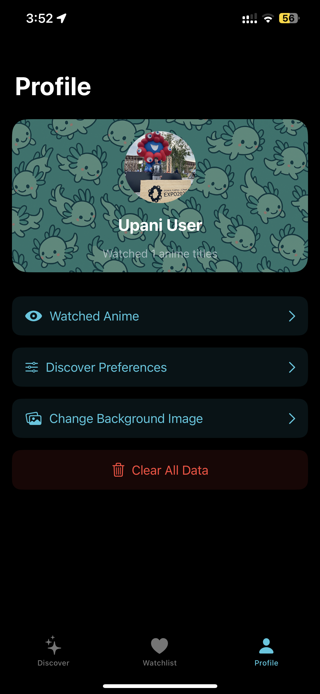
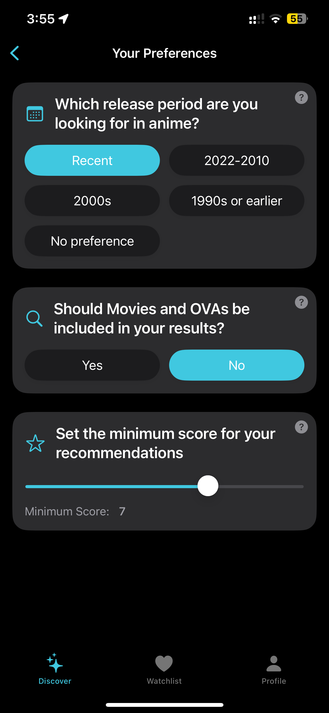
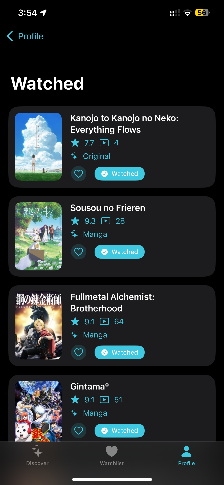
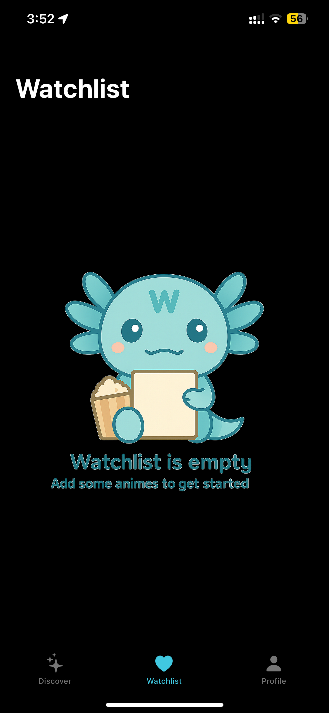

# AniCue

AniCue is an iOS app for discovering, tracking, and managing your anime watchlist and watched shows.

## Features

- **Discover Anime:** Get recommendations and search for new anime based on user prompt.
- **Anime Lists:** Maintain a list of your watchlist and watched anime 
- **Smart recommendations** Recommendations are based on user preferences and watchlist and watched anime.

## Demo 


## Planned Features 
 - **Connect to MyAnimeList Account:** Import watched and wathclist from your MAL account.
 - **Games:** Interactive games where user get recommendations based on .

## Tech Stack

- Swift, SwiftUI
- Combine
- RealmSwift for local database
- MVVM architecture

## Getting Started

1. **Clone the repository:**
   ```sh
   git clone https://github.com/yourusername/AniCue.git


## Screenshots
<div style="display: flex; gap: 10px;">
  
  
  
  
  
</div>
